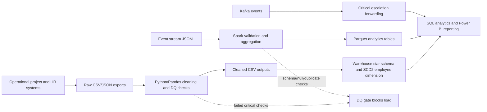

# Presight Data Governance Document

## 1. Data inventory

| Dataset | Source system | Format | Update frequency | Volume estimate | Daily growth |
|---|---|---|---|---:|---:|
| projects | Project management platform | CSV | Daily snapshot | 500 rows | 0-20 rows |
| employees | HR system | CSV | Daily snapshot | 1,000 rows | 0-10 rows |
| transactions | Finance/procurement system | JSON | Daily or near-real-time export | 50,000 rows | 1,000-5,000 rows |
| employees_salary_history | HR compensation system | CSV | On change | 1,800 historical rows | 0-20 rows |

## 2. Data classification

PII classifications include both GDPR and UAE PDPL where the person can be identified and either regulation may apply based on the employee's residency, processing location, or contractual scope.

### projects.csv

| Column | Classification | Handling |
|---|---|---|
| project_id | Internal | Stable operational identifier |
| project_name | Internal | May reveal client or program information |
| department | Internal | Business metadata |
| status | Internal | Operational status |
| start_date | Internal | Project timeline |
| end_date | Internal | Project timeline |
| budget | Confidential | Financial planning data |
| actual_cost | Confidential | Financial performance data |
| project_manager_id | Personal (PII) | Employee identifier; GDPR + UAE PDPL |
| priority | Internal | Operational planning |
| region | Internal | Business geography |

### employees.csv

| Column | Classification | Handling |
|---|---|---|
| employee_id | Personal (PII) | Direct employee identifier; GDPR + UAE PDPL |
| full_name | Personal (PII) | Direct identifier; GDPR + UAE PDPL |
| email | Personal (PII) | Contact identifier; GDPR + UAE PDPL |
| department | Internal | Role organization |
| role | Internal | Employment metadata |
| level | Confidential | Workforce classification |
| hire_date | Personal (PII) | Employment record; GDPR + UAE PDPL |
| salary | Confidential | Compensation data; access restricted to HR/authorized Finance |
| manager_id | Personal (PII) | Employee relationship; GDPR + UAE PDPL |
| region | Internal | Business geography unless combined for re-identification |
| status | Confidential | Employment status |
| years_experience | Confidential | Workforce attribute |

### transactions.json

| Column | Classification | Handling |
|---|---|---|
| transaction_id | Internal | Finance identifier |
| project_id | Internal | Project reference |
| vendor_id | Confidential | Commercial counterparty identifier |
| vendor_name | Confidential | Commercial counterparty |
| category | Internal | Spend classification |
| amount | Confidential | Financial data |
| currency | Internal | Financial metadata |
| transaction_date | Confidential | Financial activity timeline |
| approved_by | Personal (PII) | Employee identifier; GDPR + UAE PDPL |
| payment_status | Confidential | Finance control status |
| invoice_ref | Confidential | Invoice reference |
| notes | Confidential | May contain operational or personal content |

### employees_salary_history.csv

| Column | Classification | Handling |
|---|---|---|
| employee_id | Personal (PII) | Employee identifier; GDPR + UAE PDPL |
| previous_salary | Confidential | Compensation history |
| new_salary | Confidential | Compensation history |
| previous_role | Confidential | Employment history |
| new_role | Confidential | Employment history |
| previous_level | Confidential | Employment history |
| new_level | Confidential | Employment history |
| effective_date | Confidential | Employment event date |
| change_type | Confidential | HR change metadata |
| change_reason | Confidential | May disclose personal employment circumstances |

## 3. Data ownership

| Dataset | Data Owner | Data Steward | Access approver |
|---|---|---|---|
| projects | Head of Project Management | Project Operations Manager | PMO Director |
| employees | HR Director | HR Data Steward | HR Director |
| transactions | Finance Director | Finance Data Steward | Finance Director |
| employees_salary_history | HR Director | Compensation Manager | HR Director + Legal/Privacy |

The **Owner** is accountable for business purpose, risk acceptance, access policy, and retention decisions. The **Steward** manages definitions, quality rules, metadata, issue resolution, and day-to-day access requests.

## 4. Retention policy

| Dataset | Retention | Justification | Disposal | Enforcement |
|---|---|---|---|---|
| projects | 7 years after project closure | Audit trail, client obligations, and reporting | Archive, then secure deletion | PMO and Records Management |
| employees | Employment period plus 7 years | HR operations, legal claims, and employment records | Anonymize analytics copies; securely delete raw records at expiry | HR and Privacy Officer |
| transactions | 7 years after transaction date | Financial audit, tax, and procurement controls | Immutable archive followed by secure deletion | Finance and Records Management |
| salary history | Employment period plus 10 years, subject to legal review | Compensation disputes, labour-law evidence, tax/audit obligations, UAE requirements | Restricted archive, then cryptographic deletion | HR, Legal, and Privacy Officer |

Retention periods are policy defaults and must be reviewed against the applicable UAE labour, tax, contractual, GDPR, and UAE PDPL obligations. Legal holds override routine deletion.

## 5. Access control

| Persona | Projects | Employees | Transactions | Salary History |
|---|---|---|---|---|
| Data Engineer | Read + Write | Read + Write | Read + Write | None by default; temporary approved access only |
| BI Analyst | Read | Read, masked PII | Read | None |
| Finance Team | Read | None | Read + Write | None |
| HR Team | Read | Read + Write | None | Read + Write |
| Executive | Read, aggregated preferred | Read, aggregated/masked | Read, aggregated preferred | None |

Access follows least privilege, purpose limitation, masking, audit logging, and time-bound elevation. Salary history is restricted because it contains highly sensitive compensation and employment information.

## 6. Data lineage

Transformations occur in the Python ETL and Spark pipelines. Quality checks run before warehouse/reporting loads; Airflow's DQ gate prevents downstream execution when key completeness or uniqueness fails.
