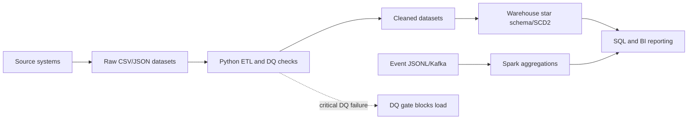

# Presight Data Governance Summary

This artifact corresponds to the full governance document in `solutions/submissions/adil_razack/04_infrastructure/data_governance.md`.

## Inventory

| Dataset | Source | Format | Frequency | Volume |
|---|---|---|---|---:|
| projects | Project management platform | CSV | Daily | 500 rows |
| employees | HR system | CSV | Daily | 1,000 rows |
| transactions | Finance/procurement | JSON | Daily export | 50,000 rows |
| employees_salary_history | HR compensation | CSV | On change | ~1,800 rows |

## Classification and PII

Employee identifiers, names, emails, hire dates, manager identifiers, approver identifiers, and salary-history employee IDs are **Personal (PII)** under GDPR and UAE PDPL. Salary, role history, employment status, transaction amounts, vendors, invoice references, project budgets, and notes are **Confidential**. Project identifiers, departments, statuses, categories, regions, and dates are **Internal** unless aggregated for approved external reporting.

## Ownership and retention

HR owns employee and salary data; Finance owns transactions; PMO owns projects. Stewards are the HR data steward, compensation manager, finance data steward, and project operations manager respectively. Projects and transactions are retained seven years for audit and contractual needs. Employee records are retained for employment plus seven years. Salary history is retained for employment plus ten years, subject to UAE labour/tax requirements and legal holds. Records are archived, anonymized where suitable, then securely deleted by Records Management, HR, Finance, and Privacy.

## Access control

| Persona | Projects | Employees | Transactions | Salary history |
|---|---|---|---|---|
| Data Engineer | Read + Write | Read + Write | Read + Write | None by default |
| BI Analyst | Read | Read, masked PII | Read | None |
| Finance Team | Read | None | Read + Write | None |
| HR Team | Read | Read + Write | None | Read + Write |
| Executive | Aggregated Read | Aggregated/masked Read | Aggregated Read | None |

Least privilege, masking, audit logs, and time-bound elevated access apply. Salary history is restricted because it is highly sensitive compensation data.

## Lineage

